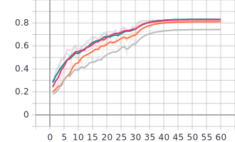
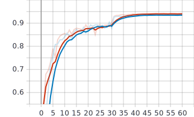

# Курсовая работа

## Локальное обучение

### Конфигурация

#### Система

- AMD Ryzen 9 5900HX CPU
- NVIDIA GeForce RTX 3070 Laptop GPU

#### ПО

- Windows 10 Home Edition
- CUDA 11.1
- Python 3.8.7 64bit
- PyTorch 1.8.1

#### Параметры

- Набор данных [CIFAR-10](https://www.cs.toronto.edu/~kriz/cifar.html)
  - 10 классов по 5000 тренировочных и 1000 валидационных изображений 32✕32px
- 50 эпох
- 64 размер батча
- Коэффициент скорости обучения:
  - 0.1 до 30 эпохи
  - 0.01 до 40 эпохи
  - 0.001 до 50 эпохи
    - 51-60 эпохи с 0.0001 - плато, обучение будет до 50.
- Сокращение веса 5e-4
- Момент Нестерова 0.7
- Архитектуры (исправленные под размер входа):
  - [ResNet18](https://arxiv.org/abs/1512.03385v1)
    - ResNet34, ResNet50 имплементированы

#### Использование скрипта

- Обучение:
`python train.py`
  - Конфигурация:
    - `-net=resnet18` - архитектура, принимает `resnet18`, `resnet34`, `resnet50`
    - `[-cuda]` - использовать GPU
    - `-e=50` - количество эпох
    - `-b=64` - размер батча
    - `-lr=0.1` - базовый темп обучения
    - `-ms=[30, 40]` - пороги
    - `-g=0.1` - понижение темпа по достижению порогов
      - `LR *= g if (E > next(ms))`
  - Оптимизация:
    - `-wd=5e-4` - сокращение весов
    - `-m=0.7` - момент Нестерова
    - `-cn=0.25` - порог нормы градиента
      - `grad /= ||grad|| if ||grad|| > cn`
    - `-cr=0.01` - коэффициент компрессии
    - `-w=4` - количество разогревочных эпох с повышенным коэффициентом
    - `-wcr=0.5` - начальный разогревочный коэффициент компрессии:
      - `CR = min(cr, wcr ** (e + 1)) if E <= W else cr`
  - Вывод:
    - `[-s]` - без вывода
    - `[-tb]` - использовать TensorBoard
  - *TODO* Распределение:
    - `-ws=1` - `world_size`
      - если 1, то обучение локально
    - `-r=0` - `rank`
      - если `ws!=1` и `r!=0`, то создаётся работник, иначе - сервер

### Результаты

#### ResNet18

- GPU: ≈0.16с/б, CPU: ≈1.6с/б
- 1.0 данных (781 батчей)
  - *GPU: ≈120с/э ≈1ч45м*
  - CPU: ≈1200c/э ≈17ч30м
  - Точность: 0.9403
- 0.1 данных (78 батчей)
  - *CPU: ≈12с/э ≈15м*
  - *CPU: ≈120с/э ≈1ч45м*
  - Точность: 0.8314
- 11.2M параметров

### Опыты

#### 0.1 данных

- Красный (0.8309)
  - [DGC](2)
- Зелёный (0.8309)
  - [DGC](2) без моментов `-m -1`
    - без моментов
- Оранжевый (0.8121)
  - [GD](1) с разогревом `-m -1 -cn -1`
    - без моментов
    - без ограничения градиента
- Серый (0.743)
  - [GD](1) `-m -1 -cn -1 -w -1`
    - без моментов
    - без ограничения градиента
    - без разогрева

Выводы:

- наивная компрессия весов приводит к ужасному результату на маленьком наборе данных
  - предварительный разогрев с более плотными градиентами сильно улучшает ситуацию
- [DGC](2) даёт лучший результат
  - момент не оказывает сильного влияния, но можно попробовать его увеличить

#### 1.0 данных

- Красный (0.9403)
  - [DGC](2)
    - без дополнительных параметров
- Синий (0.9
  - [GD](1) с разогревом `-m -1 -cn -1`
    - без моментов
    - без ограничения градиента

Выводы:

- на полном наборе данных результат почти аналогичный
  - [DGC](2) даёт лучшую сходимость и лучший результат

## Репозитории

- [Deep Gradient Compression](https://github.com/synxlin/deep-gradient-compression) - распределённое обучение с Horovod и PyTorch, код опорной работы [Y.Lin et al. [2017]](2)
  - [GRAdient ComprEssion for distributed deep learning](https://github.com/sands-lab/grace) - основа для реализации выше
- [DGS PyTorch](https://github.com/yanring/DGS) - код работы [Z.Yan et al. [2019]](https://dl.acm.org/doi/10.1145/3404397.3404401), реализация других подходов, включая [A.Aji, K.Heafield [2017]](1)

[1]: https://arxiv.org/abs/1704.05021 "A.Aji, K.Heafield [2017]"
[2]: https://arxiv.org/abs/1712.01887 "Y.Lin et al. [2017]"
